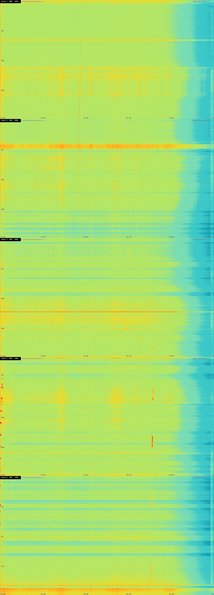
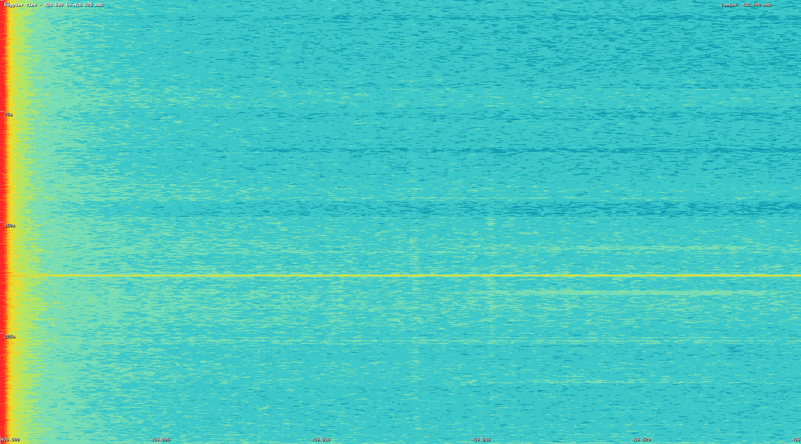
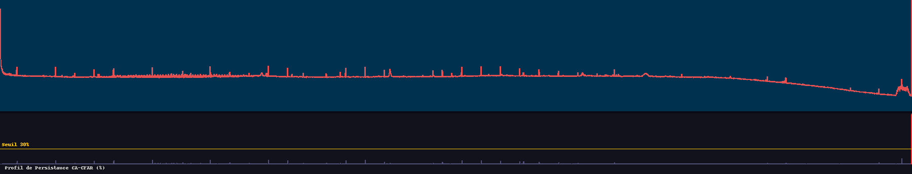
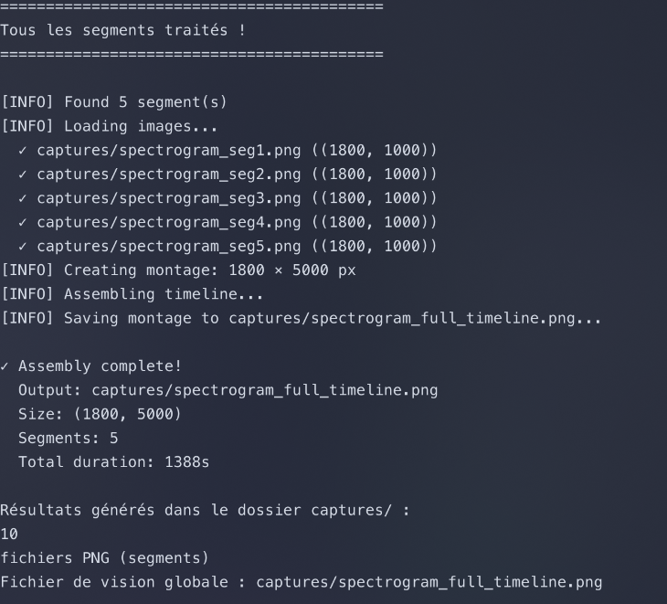

# Project Report: GPU-Accelerated Radio Signal Processing

**Participants:** Gabriel GAUTIER, Maxime BORGHINI

## 1. Subject 5: GPU FFT processing for radio waves
**Difficulty:** 6
> *Implementing Fast Fourier Transform (FFT) on the GPU is a well-understood problem but
applying it to process radio waves effectively requires understanding signal processing and
managing large data volumes efficiently.*

### Project Overview
This project implements a high-performance signal processing pipeline designed to handle massive Software-Defined Radio (SDR) recordings from Low Earth Orbit (LEO) satellites. It specifically targets the **QB50 satellite constellation**, providing an automated workflow to detect satellite passes, analyze Doppler shifts, and generate high-resolution waterfall spectrograms. By leveraging **NVIDIA CUDA**, the engine performs complex spectral analysis at speeds significantly exceeding real-time, even for datasets (like the 16GB QB50 recording) that exceed available system RAM.

### How we met the requirements
To address the "effective processing" aspect of the subject, we implemented several advanced features:
*   **Throughput Optimization**: Used an **Asynchronous Pipeline** with CUDA Streams to overlap Host-to-Device transfers, Kernels computation, and Device-to-Host transfers. This ensures the GPU is never idle.
*   **Memory Efficiency**: Developed a **Streaming Architecture** that processes data in batches. This allows the system to analyze a 16GB recording on a machine with limited VRAM/RAM by writing results incrementally to disk.
*   **Advanced Signal Analysis**:
    *   **Multi-windowing**: Support for Hamming, Blackman-Harris, and Hann windows to minimize spectral leakage.
    *   **CA-CFAR (Cell-Averaging Constant False Alarm Rate)**: An adaptive thresholding algorithm implemented on GPU to detect signals vs noise automatically.
    *   **Real-time Bandpass Filter**: Frequency-domain filtering performed post-FFT to isolate satellite transmissions.

## 2. Dataset & External Sources
The project is based on IQ recordings of the **QB50 satellite constellation**.
*   **Direct Download (16GB .wav)**: [qb50-436500kHz-2017-05-29-182529.wav](https://zenodo.org/records/6402965/files/qb50-436500kHz-2017-05-29-182529.wav?download=1)
*   **Source Citation**: [Dani Estevez - An STRF crash course](https://destevez.net/2019/01/an-strf-crash-course/)
*   **Zenodo Repository**: [Zenodo Record 6402965](https://zenodo.org/record/6402965#.YkYSTIrtaCg)

## 3. Platform & Technologies
- **OS Requirement:** Linux (Ubuntu 22.04+ recommended).
- **Hardware:** Laptop with NVIDIA GeForce RTX 3050 Ti (Ampere Architecture).
- **Languages:** C++/CUDA for the compute engine, Python for signal conversion and visualization.
- **Libraries:** cuFFT (Fast Fourier Transform), NumPy, Pillow (PIL).

## 4. Minimum System Requirements
To run this pipeline successfully, the following baseline is required:
- **OS**: Linux (Essential for shell scripts and file paths).
- **GPU**: NVIDIA GPU with CUDA support (Compute Capability 6.1 or higher).
- **VRAM**: 2 GB minimum (the streaming architecture is optimized for low-memory GPUs).
- **RAM**: 4 GB minimum (the pipeline uses ~1GB of system RAM thanks to incremental processing).
- **Disk Space**: At least 40 GB of free space (to hold the 16GB raw recording and generated outputs).

## 5. Logical Steps of the Pipeline
1.  **Data Ingestion**: Converting SatNOGS WAV files to raw Complex Float32 binary IQ format.
2.  **GPU Streaming**: Loading small batches into Pinned Memory for fast PCIe transfer.
3.  **Spectral Analysis**: Applying Windowing and performing FFT via cuFFT.
4.  **GPU Filtering**: Zeroing out-of-band bins in the frequency domain.
5.  **Adaptive Detection**: Running the CA-CFAR kernel to flag significant signal presence.
6.  **Sparse Compression**: Exporting only high-magnitude bins to reduce disk I/O and D2H overhead.
7.  **Visualization**: Generating waterfall spectrograms with automated Doppler-shift zooming.

## 5. Execution Guide
1.  **Compilation:**
    ```bash
    ./build.sh
    ```
2.  **Processing:**
    ```bash
    ./process_qb50_segments.sh
    ```

## 6. Recommended Screenshots for Evaluation
When converting this report to PDF, please include the following captures from the `captures/` folder:
1.  **captures/spectrogram_full_timeline.png**: The global overview of the satellite pass.

2.  **captures/spectrogram_doppler_seg3.png**: A clear zoom showing the characteristic Doppler curve.

3.  **captures/spectrum_avg_seg5.png**: The average power spectrum and the CA-CFAR persistence profile.

4.  **Terminal Output**:

5.  **Execution Log**: See `record.log` for a full trace of the execution on my machine.